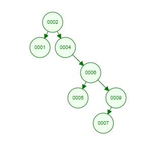

1. Draw a BST

- Given the data 3,1,4,6,9,2,5,7, if you were to insert this into an empty binary search tree, what would the tree look like? (Draw the tree, no coding needed here.)

- Draw the BST with the keys - E A S Y Q U E S T I O N
                               

2. Remove the root

- Show how the above trees would look like if you deleted the root of each tree. (Draw the trees, no coding needed here.)

Explanation: 
- Node to delete has two children. 
- Find largest node in left subtree. 
- Copy largest value of left subtree into node to delete

